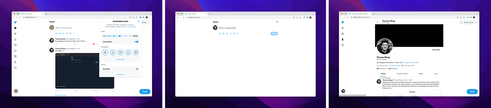

## Install Extension

- **Add to Chrome**: **[Available in the Chrome Web Store](https://chrome.google.com/webstore/detail/minimal-twitter/pobhoodpcipjmedfenaigbeloiidbflp)**
- **Add to Firefox**: **[Available as a Firefox Browser Add-on](https://addons.mozilla.org/en-US/firefox/addon/minimaltwitter/)**



Alternatively, you may copy the [base styles](extension/content/main.css) as userstyles manually with [Firefox's built-in Style Editor](https://developer.mozilla.org/en-US/docs/Tools/Style_Editor), or using extensions like [Stylish for Chrome](https://chrome.google.com/webstore/detail/stylish-custom-themes-for/fjnbnpbmkenffdnngjfgmeleoegfcffe) and [Cascadea for Safari](https://apps.apple.com/app/cascadea/id1432182561).

## Customize

Customizations, preferences, options! Access them by clicking the extension's icon as a popup or in full screen in [Options (Chrome)](https://developer.chrome.com/docs/extensions/mv3/options/) or [Preferences (Firefox)](https://support.mozilla.org/en-US/kb/firefox-options-preferences-and-settings).

_You can_

- Control Feed / Timeline Width
- Toggle Navigation: Buttons, Centering, Labels
- Activate **Zen Mode**
- ...and more!

## Development

### Building the Extension

First, you must have [classic yarn](https://classic.yarnpkg.com/lang/en/docs/install/#mac-stable) installed. Then, go to [customize-app](./customize-app) and run the build command to build the static [Next.js](https://nextjs.org/) app, which is used for the extension's customization popup and options.

```sh
cd customize-app
```

```sh
yarn # must run yarn once first before you can build
yarn run build
```

You can then go to [extension](./extension) and begin testing in `chrome://extensions` on Chrome and `about:debugging#/runtime/this-firefox` on Firefox.

Make sure to rename `manifest.chrome.json` or `manifest.firefox.json` to `manifest.json` on Chrome and Firefox, respectively. The main difference is Firefox currently does not support [Manifest V3](https://developer.chrome.com/docs/extensions/mv3/intro/).

```sh
cd extension
```

#### Chrome

```sh
mv manifest.chrome.json manifest.json
```

#### Firefox

```sh
mv manifest.firefox.json manifest.json
```
