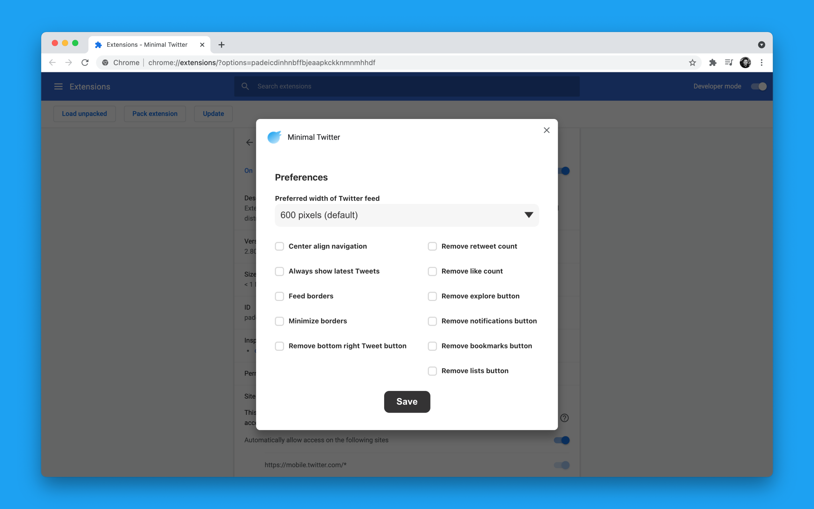
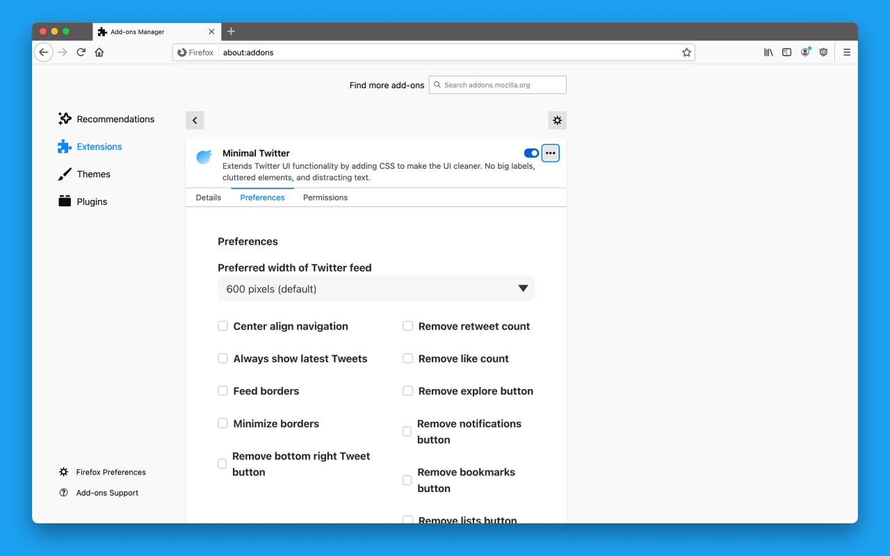

  

<h1 align="center">
  Minimal Twitter
    
</h1>

  
  

Minimal Theme for the new Twitter UI – [install now](#installation)!

This theme aims to drastically simplify and declutter the new Twitter UI. By default:

- No border on main feed
- Hidden navigation labels (shown on hover)
- Navigation pushed to left side of window
- No trends or “Who to Follow” on Home Page
- Search on top right
- Tweet button on bottom right.

## Installation

- [Chrome Extension](#chrome)
- [Firefox Add-on](#firefox)
- [Safari Extension - unofficial](#safari-extension-unofficial)

### Chrome

[Download Chrome extension in the Chrome Web Store](https://chrome.google.com/webstore/detail/pobhoodpcipjmedfenaigbeloiidbflp)

[How to set Chrome preferences](#chrome-preferences)

#### Workaround/Backup

In case there are issues with the Chrome Web Store, follow these instructions to get the latest Chrome extension version:

1. Clone or Download this repo
2. Open Chrome, then type in `chrome://extensions` in your address bar.
3. Enable Developer Mode by clicking the toggle switch next to **Developer** mode.
4. Click the **LOAD UNPACKED** button
5. Select the extension folder/directory, called `chrome` that you downloaded in this repo

### Firefox

[Download Firefox add-on in Firefox Browser Add-ons](https://addons.mozilla.org/en-US/firefox/addon/min-twitter/)

[How to set Firefox preferences](#firefox-preferences)

### Safari Extension (unofficial)

To install Minimal Twitter on Safari, just follow the below instructions:

1. Download the [the Minimal Twitter GitHub repository](https://github.com/thomaswangio/minimal-twitter/archive/master.zip)
2. Unzip the zipped Minimal Twitter file that you just downloaded.
3. Go to Safari > Preferences and click on the Advanced tab.
4. Check the box "Show Develop menu in menu bar"
5. Now, go to Develop > Show Extension Builder
6. Click the + button > Add Extension
7. Go to the unzipped Minimal Twitter and select the `twitter.safariextension` folder.
8. Click run

_Why is this unofficial? Well... Official Safari extensions require me to have Apple Developer Program membership and create a Apple developer certificate. Because Apple Developer membership costs \$99 + tax a year, unforunately, I can't add an official extension right now (too broke)._

## Chrome and Firefox Preferences

Customization currently available in Chrome and Firefox! ⚙️

- Select preferred width of Twitter feed sections
- Anchor navigation to top
- Minimize borders between tweets, in explore, and in notifications
- Hide the bottom right Tweet button
- Hide retweet and/or like numbers

### Chrome Preferences

1. Right click or secondary click on the Minimal Twitter Extension and select "Options"
2. Set user preferences
3. Click "Save" button

### Firefox Preferences

1. Right click or secondary click on the Minimal Twitter Extension and select "Manage Extension"
2. Go to "Preferences" tab
3. Select preferences
4. Click "Save" button

## Developing

Feel free to clone/fork this repository and extend it to your ❤️'s delight. The following documentation is the official documentation used at time of development.

- [Chrome Extensions Documentation](https://developer.chrome.com/extensions)
  - [How to load extensions into Chrome locally](https://developer.chrome.com/extensions/getstarted#manifest)
- [Firefox Add-ons Documentation](https://developer.mozilla.org/en-US/docs/Mozilla/Add-ons)
  - [How to load add-ons into Firefox locally](https://developer.mozilla.org/en-US/docs/Mozilla/Add-ons/WebExtensions/Temporary_Installation_in_Firefox)
- [Safari App Extensions Documentation](https://developer.apple.com/documentation/safariservices/safari_app_extensions)
  - [Using the Safari Extension Builder](https://developer.apple.com/library/archive/documentation/Tools/Conceptual/SafariExtensionGuide/UsingExtensionBuilder/UsingExtensionBuilder.html)

## Support this project!

If you found this project useful, consider supporting me on [GitHub Sponsors](https://github.com/sponsors/thomaswangio) :)
