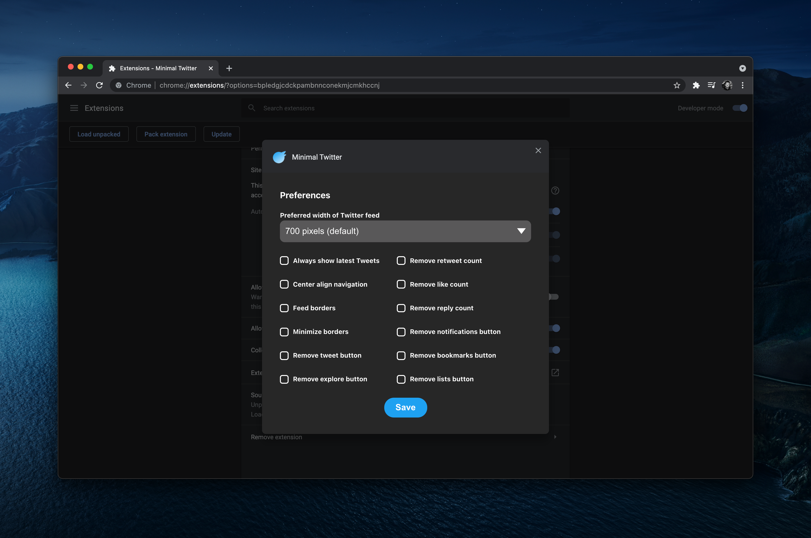
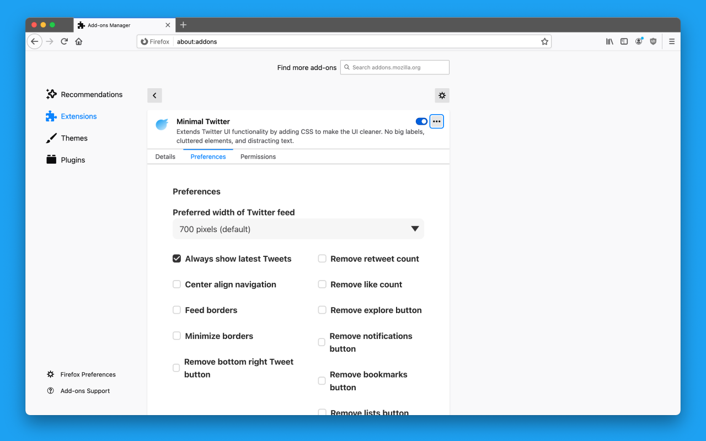
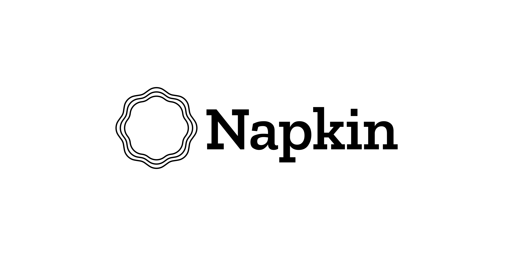

  

<h1 align="center">
  Minimal Twitter
</h1>

Minimal Theme for the new Twitter UI – [install now](#installation)!

A minimal Twitter theme that drastically simplifies and declutters the new Twitter UI.

- No promoted posts
- No Topics Selection
- No trends or "Who to Follow" on Home Page
- No "Who To Follow" in Timeline/Profiles
- No border on main feed
- No message drawer
- Hidden navigation labels (shown on hover)
- Navigation pushed to left side of window
- Search on top right
- Tweet button on bottom right

## Installation

- [Chrome Extension](#chrome)
- [Firefox Add-on](#firefox)
- [Safari using Cascadea](#safari)

### Chrome

[Download Chrome extension in the Chrome Web Store](https://chrome.google.com/webstore/detail/pobhoodpcipjmedfenaigbeloiidbflp)

[How to set Chrome preferences](#chrome-preferences)

### Firefox

[Download Firefox add-on in Firefox Browser Add-ons](https://addons.mozilla.org/en-US/firefox/addon/min-twitter/)

[How to set Firefox preferences](#firefox-preferences)

### Safari

We recommend using [Cascadea](https://apps.apple.com/us/app/cascadea/id1432182561) to inject the [Minimal Twitter stylesheet](./twitter.safariextension/minimal-twitter.css).

## Chrome and Firefox Preferences

Customization currently available in Chrome and Firefox! ⚙️

### Chrome Preferences

1. Right click or secondary click on the Minimal Twitter Extension and select "Options"
2. Set user preferences
3. Click "Save" button

### Firefox Preferences

1. Right click or secondary click on the Minimal Twitter Extension and select "Manage Extension"
2. Go to "Preferences" tab
3. Select preferences
4. Click "Save" button

## Sponsor

