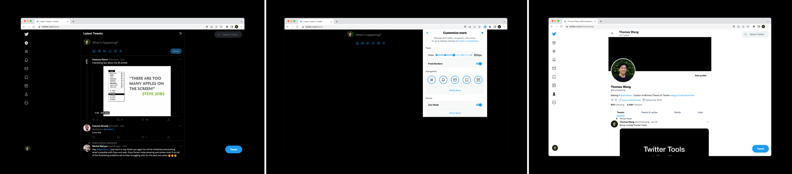
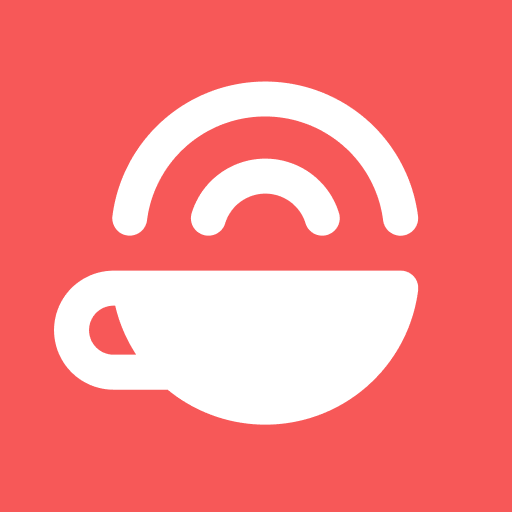

## Install Extension

- **Add to Chrome**: **[Available in the Chrome Web Store](https://chrome.google.com/webstore/detail/pobhoodpcipjmedfenaigbeloiidbflp)**
- **Add to Firefox**: **[Available as a Firefox Browser Add-on](https://addons.mozilla.org/en-US/firefox/addon/minimaltwitter/)**
- **Add to Microsoft Edge**: **[Available as a Microsoft Edge Add-on](https://microsoftedge.microsoft.com/addons/detail/mghjldihobnccoppgcgfelpdpffmebjn)**

Alternatively, you can use the [base styles](extension/content/main.css) as userstyles (e.g. with [Firefox's built-in Style Editor](https://developer.mozilla.org/en-US/docs/Tools/Style_Editor) or using extensions like [Stylish for Chrome](https://chrome.google.com/webstore/detail/stylish-custom-themes-for/fjnbnpbmkenffdnngjfgmeleoegfcffe) and [Cascadea for Safari](https://apps.apple.com/app/cascadea/id1432182561)).

To contribute and/or see development instructions, go to [CONTRIBUTING](./.github/CONTRIBUTING.md).

## Customize

Customizations, preferences, options! Access them by clicking the extension's icon as a popup or in full screen in Options (Chrome & Edge) or Preferences (Firefox).

— _You can_ —

- Control Feed / Timeline Width
- Control Navigation UI: Buttons, Centering, Labels
- Activate **Zen Mode**
- ...and more!

## Sponsors

Thanks to the below sponsors for supporting! If you'd like to be added as a sponsor, please reach out [via email](mailto:wang@hey.com?subject=Sponsorship).

