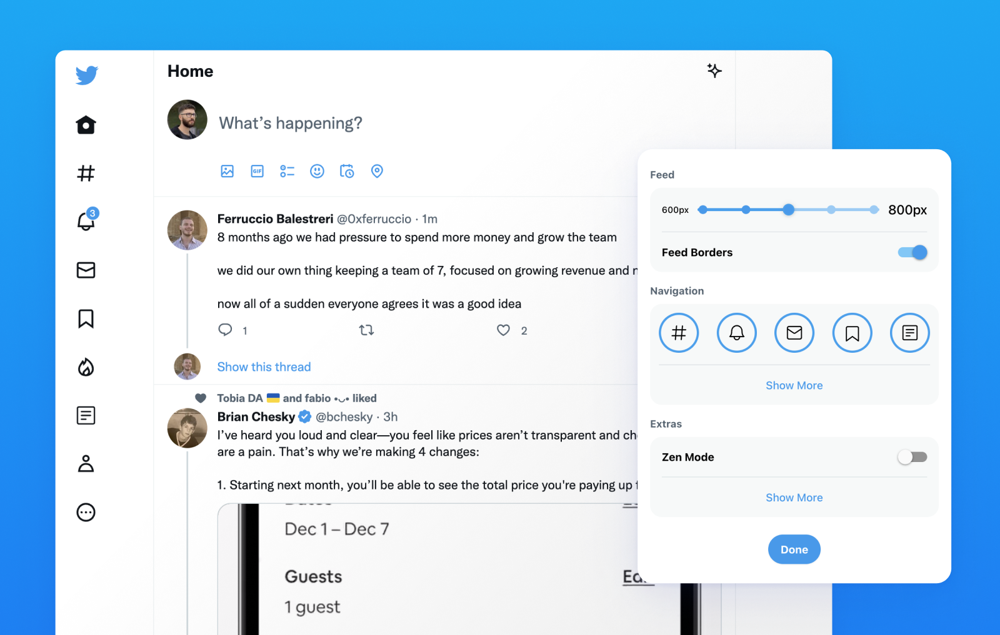

  

<h1 align="center">
  Minimal Theme for Twitter by <a href="https://typefully.com/?ref=minimal-twitter">Typefully</a>
</h1>

- **Add to Chrome**: **[Available in the Chrome Web Store](https://chrome.google.com/webstore/detail/pobhoodpcipjmedfenaigbeloiidbflp)**
- **Add to Firefox**: **[Available as a Firefox Browser Add-on](https://addons.mozilla.org/en-US/firefox/addon/minimaltwitter/)**
- **Add to Microsoft Edge**: [NEW SOON]
- **Add to Safari**: [NEW SOON]
- **Add Manually**: **[Manual Installation](./MANUAL_INSTALLATION.MD)**

Minimal Theme for Twitter is a browser extension originally made by [Thomas Wang](https://thomas.wang), and now developed by the [Typefully](https://typefully.com/?ref=minimal-twitter) team. To contribute / see development instructions, go to [CONTRIBUTING](./.github/CONTRIBUTING.md).

## Description

Refine and clean up the Twitter interface, and customize your experience:

- Remove the distracting trends sidebar
- Customize your Timeline width
- Remove Timeline borders for a more minimal look
- Customize the left navigation
- Hide view count and vanity counts under tweets
- Remove promoted posts
- Remove "Who to Follow" and other suggestions
- Hide the Search Bar
- Hide the Tweet button
- And more...

## By the makers of Typefully

We also make [Typefully](https://typefully.com/?ref=minimal-twitter), which helps you craft better tweets &amp; threads, and grow faster on Twitter.

